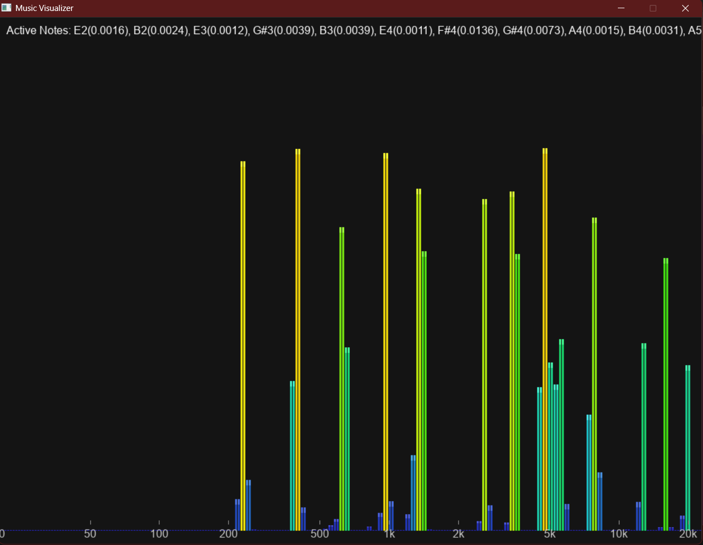
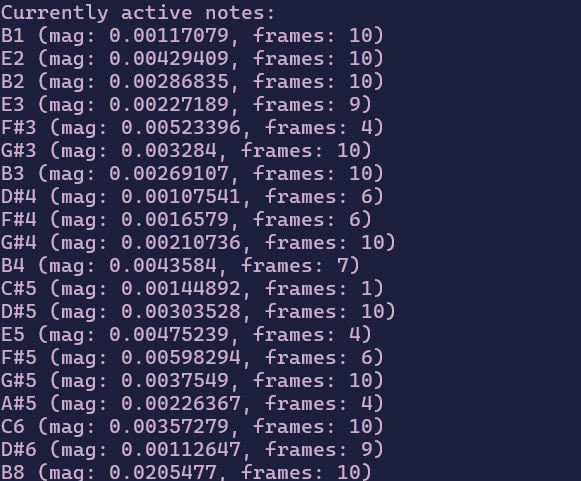

# Audio Visualizer and Analyzer

This project is a real-time audio visualizer that processes WAV audio files, analyzes their frequency spectrum using the Fast Fourier Transform (FFT), and displays the output using SDL2.



## Screenshots

Here are a couple of screenshots showcasing the application in action.

| Main GUI                                    | Active Note Dectection (Terminal)           |
| ------------------------------------------- | ------------------------------------------- |
|  |  |

## How It Works

The application processes audio in a series of sequential steps to produce a real-time visualization:

1.  **WAV File Loading**: The program begins by loading a user-specified `.wav` file. It reads the file's header into a `WavHeader` struct and validates it to ensure it's a compatible format. The raw audio data is then read, normalized into a `std::vector<double>` of samples ranging from -1.0 to 1.0, and stored in a `WavFile` struct.

2.  **Audio Playback**: SDL2's audio API is used for playback. The loaded audio samples are passed to an audio device via a callback function, which streams the music asynchronously. User controls for pausing and resuming are handled by managing the audio stream's state.

3.  **Frame Processing**: For visualization, the audio samples are processed in overlapping frames (or windows). For each frame:
    a.  A **Hanning Window** is applied to the samples to reduce spectral leakage, which can cause frequencies to bleed into adjacent bins.
    b.  The **Fast Fourier Transform (FFT)** is performed on the windowed samples to convert them from the time domain to the frequency domain.

4.  **Frequency Analysis & Note Detection**:
    a.  The raw FFT output is converted to a decibel scale, and an **A-weighting** filter is applied to adjust the frequencies to better match the perceived loudness of the human ear.
    b.  **Peak Detection** logic scans the frequency spectrum to find significant peaks that rise above a noise threshold.
    c.  For each detected peak, a **Binary Search** is performed on a pre-computed table of musical notes to identify the closest note within a set tolerance.

5.  **Rendering and Visualization**:
    a.  The frequency spectrum is rendered as a series of logarithmically-scaled frequency bands. The magnitude of each band is smoothed over time by averaging it with previous frames' magnitudes, which are stored in a `std::deque`. This creates a smoother, more fluid animation.
    b.  Active musical notes are displayed on the screen, with a persistence effect that keeps them visible for a short duration after they are no longer detected, preventing flickering.
    c.  All rendering is done using the SDL2 and SDL2_ttf libraries.

## Core Algorithms and Data Structures

-   **Fast Fourier Transform (FFT)**: A recursive, in-place **Cooley-Tukey** algorithm is implemented in the `fft` function. It takes a `std::vector<std::complex<double>>` of audio samples and transforms them, enabling the analysis of the audio's frequency components.

-   **Binary Search for Note Detection**: To efficiently identify musical notes from a given frequency, a `std::vector<MusicalNote>` is pre-populated at startup with notes and their corresponding frequencies, sorted by frequency. The `std::lower_bound` function (an implementation of binary search) is then used in the `identifyNote` function to find the closest matching note in logarithmic time complexity, which is crucial for real-time performance.

-   **Hanning Window**: A `for` loop iterates through the sample frame in the `applyHannWindow` function, applying the Hanning formula `0.5 * (1 - cos(2 * PI * i / (N - 1)))` to each sample. This simple but effective algorithm is essential for accurate frequency analysis.

-   **Data Structures for Audio and Visualization**:
    -   `WavHeader` and `WavFile`: C-style `structs` are used to map directly onto the binary format of a WAV file's header, allowing for easy parsing. The `WavFile` struct bundles the header with a `std::vector<double>` containing the audio samples.
    -   `FrequencyBand`: This `struct` organizes data for each visual bar in the spectrum, including its frequency range, magnitude, and color.
    -   `Note`: A `struct` to manage the state of a detected musical note, including its name, frequency, and a `persistenceFrames` counter to control how long it remains on screen after being detected.
    -   `AudioVisualizer` Class: This class encapsulates the entire application logic. It holds the SDL window/renderer, manages the audio state, and contains the core visualization loop.
    -   `std::deque<vector<double>>`: A deque is used within the `AudioVisualizer` to store the magnitude data of the last few frames. This allows for temporal smoothing of the visualizer bars, preventing jittery motion and creating a more aesthetically pleasing output.

## Project Structure

```
.
├── .gitignore
├── README.md
├── Makefile
├── bin/
│   ├── SDL2.dll
│   └── SDL2_ttf.dll
├── build/
├── assets/
│   ├── test.wav
│   └── piano.wav
├── include/
│   └── SDL2/
├── lib/
└── src/
    └── main.cpp
```

## Getting Started

### Prerequisites

- A C++ compiler (like G++)
- `make`
- The SDL2 and SDL2_ttf libraries are included in this repository.

### Installation & Compilation

1.  **Clone the repository:**
    ```bash
    git clone <your-repo-url>
    cd <repository-folder>
    ```

2.  **Compile the project:**
    Use the provided `Makefile` to compile the application.
    ```bash
    make
    ```
    This will create the executable in the `build/` directory.

### Running the Visualizer

Run the executable from the root of the project directory, passing the path to a WAV file as an argument. For the application to find the required `.dll` files, you should run it from the root of the project where the `bin/` directory is located.

```bash
./build/main.exe assets/test.wav
```

### Controls

-   `SPACE`: Pause/Resume playback.
-   `I`: Toggle isolation mode, which highlights active frequency bands.
-   `ESC`: Quit the application.

## Contributions

-   **Yugam Bhatt (2023aib1020)**
    -   Music note detection and peak analysis.
    -   Magnitude/decibel conversion and normalization.
    -   Frequency spectrum rendering with 60Hz synced smoothing.
    -   Error handling.

-   **Vaibhav Gupta (2023aib1019)**
    -   Cooley-Tukey FFT implementation.
    -   Frequency band calculation.
    -   Initial project ideation and research.

-   **Shashwat Saini (2023aib1015)**
    -   Hanning window implementation.
    -   A-weighting (log scaling) for audio visualization.
    -   SDL2 graphics initialization and color mapping.

-   **Nitin Kumar (2023aib1012)**
    -   WAV file parsing with dynamic metadata handling.
    -   SDL audio playback implementation.
    -   Audio buffer management for playback control.